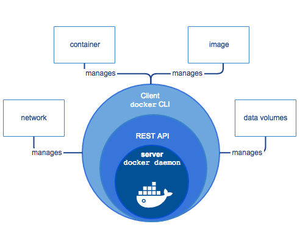

# 导读

`Docker` 是一个 用于开发、构建、发布应用程序的开放平台。它能够让我们将应用程序与基础架构分开，从而快速交付软件。

`Docker` 提供了松散隔离的环境（容器），我们能够在容器中打包、运行应用程序的功能。

同时由于 `Docker` 的**隔离性**、**安全性**使得我们可以在同一台主机上同时运行多个容器；此外，`Docker` 非常的轻巧，因为他不需要像虚拟机管理程序一样的额外负载，它是直接运行在主机的内核中！

## Why Docker

为什么选择 `Docker`，除了上述提到的一些 `Docker` 的特性之外，可以简单归纳主要是 `Docker` 提供了下述的能力：

* **快速，一致地交付您的应用程序**
* **响应式部署和扩展**
* **在同一硬件上运行更多工作负载**

其次，就是相对传统虚拟机，Docker 所具备的一些优势：

| 特性 | 容器 | 虚拟机 |
| :--- | :--- | :--- |
| 启动 | 秒级 | 分钟级 |
| 硬盘使用 | 一般为 `MB` | 一般为 `GB` |
| 性能 | 接近原生 | 弱于 |
| 系统支持量 | 单机支持上千个容器 | 一般几十个 |

## Docker 引擎

_**Docker Engine**_ 是具有以下主要组件的客户端-服务器应用程序：

* 服务器是一种长期运行的程序，称为守护程序进程（ `dockerd`命令）。
* **REST API**，它指定程序可以用来与守护程序进行通信并指示其操作的接口。
* 命令行界面（**CLI**）客户端（`docker`命令）。

**CLI** 使用 **Docker REST API** 通过脚本或直接 `CLI` 命令来控制`Docker守护程序`或与`Docker守护程序`进行交互。许多其他`Docker应用程序`都使用基础**API**和**CLI**。

守护程序创建和管理_**Docker对象**_，例如镜像、容器、网络和卷。

## Docker 架构

**Docker** 使用**客户端-服务器架构**。_`Docker客户端`_与`Docker守护进程`进行对话，该_`守护进程`_完成了构建，运行和分发`Docker容器`的繁重工作。**Docker客户端**和**守护程序**_可以_ 在同一系统上运行，或者您可以将**Docker客户端**连接到**远程Docker守护程序**。**Docker客户端**和**守护程序**在`UNIX套接字`或`网络接口`上使用**REST API**进行通信。

后续章节会详细介绍 **Docker** 的**底层架构**、**底层技术**等！

