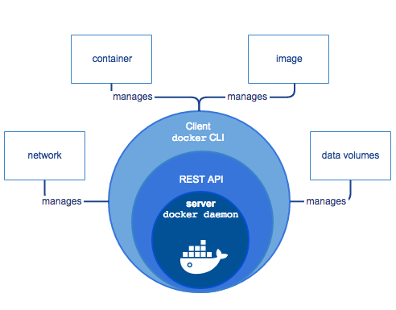

# 基本架构

## 整体架构

容器和虚拟机一样，都是虚拟化的产品，都包括计算虚拟化，存储虚拟化和 IO 虚拟化。容器作为轻量级的进程，不像虚拟机那般复杂，这三块分别靠三个 Driver 来完成的，`execdriver` 负责计算虚拟化，`networkdriver` 负责网络虚拟化，`graphdriver` 负责存储虚拟化。由此可见，Docker 靠 Driver 这种设计思想来支撑起它的基础平台，如下图（图片来自互联网）：

## Docker 引擎

_**Docker Engine**_ 是具有以下主要组件的客户端-服务器应用程序：

* 服务器是一种长期运行的程序，称为守护程序进程（ `dockerd`命令）。
* **REST API**，它指定程序可以用来与守护程序进行通信并指示其操作的接口。
* 命令行界面（**CLI**）客户端（`docker`命令）。

**CLI** 使用 **Docker REST API** 通过脚本或直接 `CLI` 命令来控制`Docker守护程序`或与`Docker守护程序`进行交互。许多其他`Docker应用程序`都使用基础**API**和**CLI**。

守护程序创建和管理_**Docker对象**_，例如镜像、容器、网络和卷。

## Docker 架构

**Docker** 使用**客户端-服务器架构**。_`Docker客户端`_与`Docker守护进程`进行对话，该_`守护进程`_完成了构建，运行和分发`Docker容器`的繁重工作。**Docker客户端**和**守护程序**_可以_ 在同一系统上运行，或者您可以将**Docker客户端**连接到**远程Docker守护程序**。**Docker客户端**和**守护程序**在`UNIX套接字`或`网络接口`上使用**REST API**进行通信。

